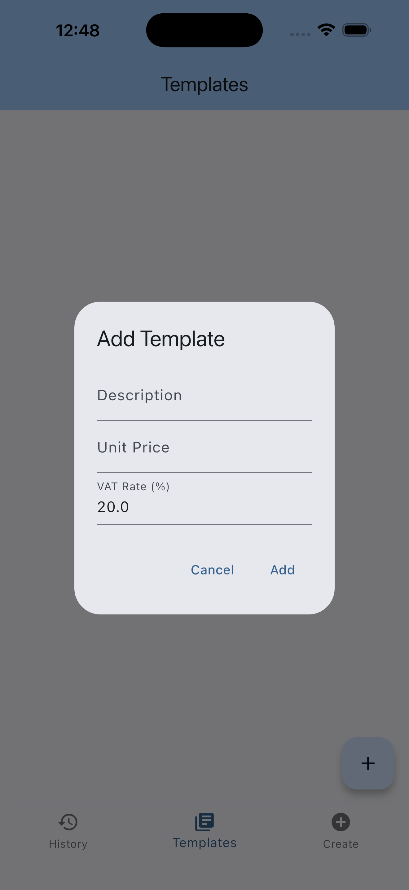
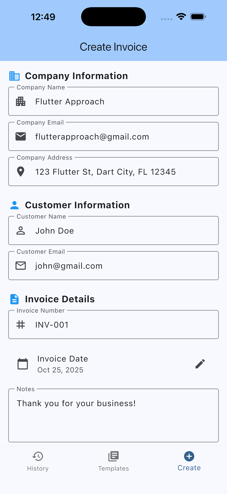
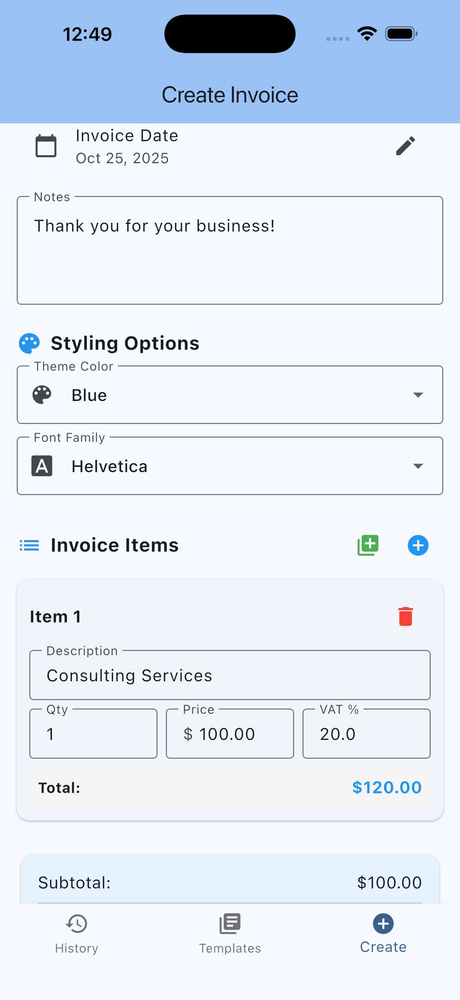
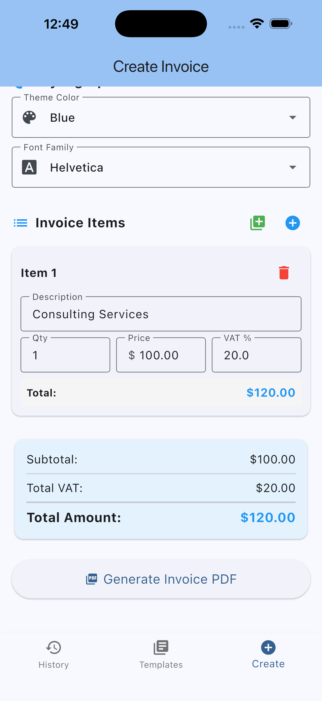

# invoice_generator

<h2 align="center">✨ App Feature Poster ✨</h2>

<p align="center">
  
  
  
  
</p>

Invoice Generator is a Flutter application for creating, managing, and exporting invoices. It provides a simple UI to build invoices from templates, store invoice history locally, and export or share invoices as PDF or other formats supported by the app.

## Table of contents

- Overview
- Features
- Architecture & key folders
- Getting started
- Development
- Project structure
- Troubleshooting
- Contributing
- License & contact

## Overview

This project is a cross-platform Flutter app intended to help small businesses and freelancers create and manage invoices quickly. The app is structured using a feature-driven modular layout with `core` utilities and `features` for domain-specific functionality such as `invoice`, `templates`, and `history`.

## Features

- Create and edit invoices with multiple line items
- Save invoice history locally (persisted via the app database)
- Choose from invoice templates
- Export or share invoices (PDF/export workflows are implemented in the project)
- Cross-platform: Android, iOS, Web, macOS, Linux, Windows (as supported by Flutter)

## Architecture & key folders

The codebase follows a modular, feature-first structure. Key folders:

- `lib/` — main application source
	- `core/` — shared utilities, DI, database, error handling, and presentation layers
	- `features/` — feature modules (e.g., `invoice`, `templates`, `history`)
	- `models/` — domain models like `invoice_data.dart` and `invoice_item.dart`
- `assets/` — images, fonts, and other static assets

See `ARCHITECTURE.md` and `IMPLEMENTATION_GUIDE.md` for design and implementation details.

## Getting started

Prerequisites

- Flutter SDK (stable) — recommended version: the latest stable release
- A working device/simulator for the target platform (Android Studio emulator, Xcode simulator, or Chrome for web)

Quick start

1. Clone the repository

```bash
git clone https://github.com/saad-lashari/invoice_generator.git
cd invoice_generator
```

2. Install dependencies

```bash
flutter pub get
```

3. Run the app (example: run on connected device or emulator)

```bash
flutter run
```

Run for specific platforms

- Android (device/emulator):

```bash
flutter run -d <android-device-id>
```

- iOS (macOS host required):

```bash
flutter run -d <ios-device-id>
```

- Web (Chrome):

```bash
flutter run -d chrome
```

Build release artifacts

```bash
flutter build apk        # Android
flutter build ios        # iOS (requires Xcode and provisioning)
flutter build web        # Web
```

## Development

- Static analysis / linting:

```bash
flutter analyze
```

- Format code:

```bash
dart format .
```

- Tests:

```bash
flutter test
```

When changing platform-specific code (native Android/iOS), open the respective folders in Android Studio or Xcode.

## Project structure (high level)

Root highlights

- `lib/main.dart` — app entrypoint
- `lib/core/` — DI, database, usecases, error handling, presentation
- `lib/features/` — feature modules (each with presentation/usecases/data layers)
- `models/` — shared data models

Platform folders are standard Flutter-generated folders (`android/`, `ios/`, `web/`, `macos/`, `linux/`, `windows/`).

## Troubleshooting

- If you see dependency or build issues, run:

```bash
flutter clean
flutter pub get
```

- For iOS code signing issues, open `ios/Runner.xcworkspace` in Xcode and resolve signing/team settings.

## Contributing

Contributions are welcome. Suggested workflow:

1. Fork the repo
2. Create a feature branch (e.g., `feat/invoice-pdf-export`)
3. Add tests for new behavior
4. Open a pull request describing the change

Please follow the existing code style and run `dart format .` and `flutter analyze` before submitting.

## License & contact

If there is a `LICENSE` file in the repository, that governs usage. If none exists, please add a license file (for example, `MIT` or other) to make reuse permissions explicit.

Maintainer / Contact: saad-lashari (GitHub: `saad-lashari`)

---

## Screenshots

Below are a few sample screens from the app (SVG placeholders included in `assets/screenshots/`). Replace these with real screenshots captured from a device or simulator for production documentation.

UI Overview

